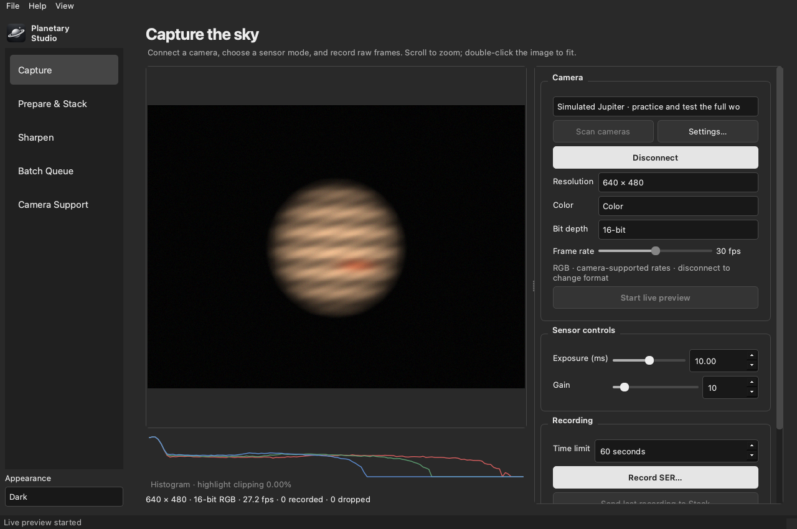
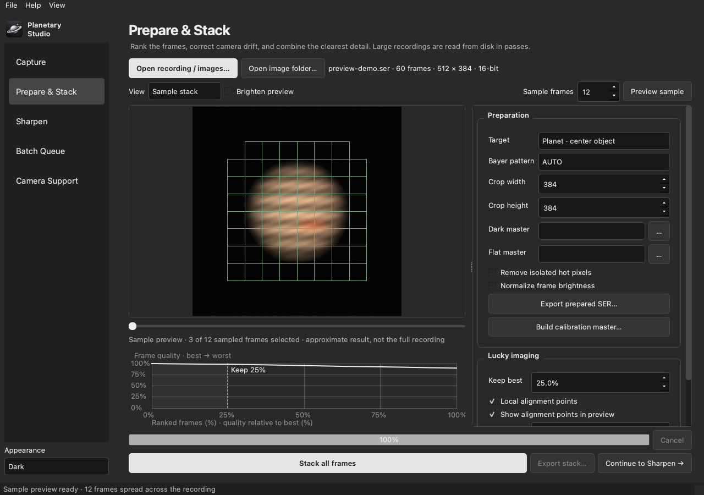

# Planetary Studio

One desktop application for **camera capture → preparation → alignment and stacking → sharpening**.
Built for macOS Apple silicon, Windows x64, and Linux x64/arm64.



Planetary Studio brings the core tasks normally performed in oaCapture, PIPP, AutoStakkert, and waveSharp into one open application. Version 0.4 is a **prerelease** with an implemented end-to-end workflow. It is not yet a feature-for-feature or image-quality equivalent of those mature applications. The algorithm and hardware limits are documented rather than hidden behind compatibility claims.

## Download

Get the portable application for your platform from [Releases](https://github.com/BrainBrian825/planetary-studio/releases).
Each release is published only after the automated tests and the **packaged application's** end-to-end self-test pass on every platform.
Development downloads are also available in [Actions](https://github.com/BrainBrian825/planetary-studio/actions).

- **macOS Apple silicon:** unzip and move `Planetary Studio.app` to Applications. The prebuilt download requires macOS 27 or newer. This community build is ad hoc signed, not Apple notarized. If macOS blocks it, use **System Settings → Privacy & Security → Open Anyway** for the app you downloaded from this repository.
- **Windows x64:** unzip the entire folder and run `PlanetaryStudio.exe` inside it. Keep the `_internal` folder beside the executable.
- **Linux:** unpack the archive and run `PlanetaryStudio/PlanetaryStudio`. The GUI needs the usual X11/Wayland desktop libraries; see [Building](docs/building.md). Direct USB access needs an appropriate udev rule.

## Appearance and camera controls

Use **Appearance** at the bottom of the sidebar, or **View → Appearance**, to choose **Follow system**, **Light**, or **Dark**. Follow system is the default and reacts to appearance changes reported by the desktop. A manual choice is saved across restarts. On desktops without system appearance reporting, use the manual override. [Light appearance preview](docs/images/light-capture.png).

On macOS, open `Planetary Studio.app` from Finder. It runs as a normal application with its own [planet logo](docs/branding.md) in the Dock. To keep it there after quitting, choose **Options → Keep in Dock** from the icon's menu.

After connecting a camera, **Resolution**, **Color / Mono**, **Bit depth**, and **Frame rate** are separate controls. The frame rate slider steps through valid rates for the other selections. Controls with only one available choice are disabled. Unsupported combinations are never sent to the driver; native Bayer formats and exact USB frame intervals are preserved. Disconnect to change the capture format after starting preview.

Exposure and gain use sliders with exact-value fields. Exposure sliders use a logarithmic scale for cameras with a wide exposure range, making short planetary exposures easier to adjust. Their limits come from the camera driver. Actual frame rate may be lower than the selected rate because of exposure time or transfer speed.

## The workflow

1. **Capture:** scan cameras, connect, choose a sensor mode, start preview, and record SER. The simulator lets you practice without hardware. Capture includes live histogram, exposure/gain controls when offered by the driver, snapshots, recording time limits, frame counters, and driver-reported dropped frames. Raw Bayer data remains raw in the recording.
2. **Prepare & Stack:** open SER, common videos, or naturally sorted TIFF/FITS/PNG image sequences. Choose object centering for planets or surface alignment for the Moon/Sun. Apply dark/flat calibration, remove isolated hot pixels, crop, and optionally normalize brightness. Export prepared SER or create a calibration master. Rank image detail, select a percentage of the best frames, register motion at subpixel resolution, and combine frames with overlapping local alignment points and local quality selection.
3. **Sharpen:** use six wavelet scales, soft noise thresholds, Richardson–Lucy deconvolution, optional AI noise cleanup, RGB alignment, channel balance, saturation, and gamma. Compare against the original and save presets. Export 16-bit TIFF/PNG or floating-point FITS.
4. **Batch Queue:** process multiple recordings using the current preparation, stacking, and sharpening settings. The queue creates distinct outputs and reports failures individually.

Projects save source paths and processing settings as readable JSON. Outputs include processing reports so the selected frames and settings can be inspected later. Original recordings are not modified.

## AI cleanup after sharpening

In **Sharpen → AI noise cleanup**, increase **Strength** from 0 to blend in FFDNet denoising. **Noise level** controls how much grain the model expects; start at 3 and increase gradually. Compare fine detail at Strength 0 before exporting. Strong settings can soften small features, and the model was trained on general photographs rather than planetary stacks.

Cleanup runs **after wavelets and deconvolution, before color and gamma adjustments**. Both monochrome and RGB models are included in the download. It runs locally on the CPU, needs no additional downloads or GPU, and does not upload images. It retains floating-point pixels through processing and supports 16-bit/float exports. Cleanup is off by default; old projects and presets keep it off. New presets, projects, batch processing, and export reports include the selected settings.

[Model provenance, licenses, validation, and integration details](docs/ai-denoising.md).

## Preview before processing the full recording



The **Prepared frame** view updates as you change Bayer pattern, centering, calibration, hot-pixel removal, crop dimensions, or output size. Use the frame slider to check another point in the recording, or switch to **Original frame** for comparison. Frame numbers and preview dimensions are displayed. **Brighten preview** affects display only; saved pixels keep their actual brightness.

Use **Preview sample** to stack 2–64 evenly spaced frames (12 by default) with the current settings. The result is labeled as an approximate sample. Send it to **Sharpen** to tune the finishing settings, then run **Stack all frames** for the final image. A sample is not a full assessment of atmospheric seeing and can select different frames from the full recording.

The quality graph has percentage grid lines, relative quality labels, and a **Keep best** cutoff marker. **Show alignment points in preview** overlays the planned patch areas without changing image pixels. The main stack/export/sharpen actions remain visible below the settings panel.

Raw grayscale AVI files may contain Bayer samples without a pattern tag. Select the appropriate Bayer pattern and compare its preview; AUTO cannot determine the camera or any recording flips from an untagged file. Already converted color images should use AUTO.

All file pickers start in the last folder you selected in the app, and remember it across restarts. Save dialogs honor **Replace** for existing outputs; processing exports require a different file from the source recording or images.

## Cameras

| Connection | Platforms | Capabilities | Validation |
|---|---|---|---|
| Direct USB UVC | macOS, Linux | GRBG/RGGB/GBRG/BGGR, mono, RGB, YUV, MJPEG; advertised sizes/rates; 8/16-bit where available | **NexImage 10 raw GRBG8 recorded on macOS 27 arm64**; native library built on Linux |
| System camera drivers | macOS, Windows, Linux | AVFoundation / DirectShow / V4L2 converted 8-bit RGB | Application builds; individual camera drivers require hardware validation |
| ZWO ASI SDK | macOS, Windows, Linux | Raw8/Raw16, RGB24, mono, sensor ROI, gain/exposure/offset/bandwidth where available | ABI and adapter tests; hardware validation pending |
| QHY SDK | macOS, Windows, Linux | Live Raw8/Raw16, sensor ROI, gain/exposure/offset/USB controls where available | Adapter tests; hardware validation pending |
| INDI | All | FITS single exposures from server camera drivers | Protocol and FITS tests; camera model validation pending |
| ASCOM Alpaca | All | Network camera exposures, ImageBytes v1 and JSON fallback | Tested against a local protocol server; camera model validation pending |
| Simulator | All | Noisy, moving synthetic Jupiter, 16-bit RGB capture | Complete capture → SER → stack → sharpen → export tested |

[Camera setup and limitations](docs/cameras.md) explains driver installation and how INDI/Alpaca can expose many additional camera families. Vendor SDK binaries are supplied by their manufacturers and are not redistributed in this release. A listed adapter does not mean every manufacturer's model has been tested.

## Processing details

- Internal processing uses normalized float32; stack accumulation uses float64. Raw capture remains unsigned 8/16-bit.
- SER files are memory mapped. Processing reads frames in passes instead of retaining the complete recording in RAM. Quality metadata is proportional to frame count × alignment point count. Video seeking and raw disk bandwidth still affect speed.
- Global alignment uses phase correlation and a reference built from the best frames. Local points use overlapping feathered patches and independent frame ranking. Texture-free areas fall back to the global stack.
- Quality is gradient energy after mild noise smoothing. Extremely noisy or saturated data can still affect rankings. Exposure normalization is optional.
- 1.5× and 2× outputs use Lanczos resampling. **Drizzle reconstruction, planetary rotational derotation, GPU processing, and advanced atmospheric-dispersion modeling are not implemented in 0.4.**
- The engine is independently implemented; it does not contain AutoStakkert or waveSharp code. There has been no claim of numerical equivalence to their algorithms.

## Build or run from source

```sh
python3.12 -m venv .venv
# Activate the environment for your shell, then:
python -m pip install -r requirements-build.txt
python -m pip install --no-deps -e .
# macOS/Linux: install libusb development files and pkg-config first.
python native/build.py
python -m planetary_studio
```

[Detailed build instructions](docs/building.md), [file formats](docs/formats.md), and [validation](docs/validation.md).

## Command line

```sh
planetary-studio demo demo.ser --frames 60
planetary-studio stack demo.ser result.tif --keep 25 --ap-size 64
planetary-studio stack moon.ser moon-stack.fits --surface --keep 50
planetary-studio probe-camera NexImage test.ser --seconds 3
planetary-studio --self-test --report selftest.json
```

The packaged executable accepts the same arguments. A self-test checks recording, timestamps, ranking, alignment, stacking, sharpening, high-depth exports, and desktop startup. It does not claim to test absent cameras.

## License

GPL-3.0-or-later for Planetary Studio. The vendored libuvc code retains its BSD license. See [third-party notices](THIRD_PARTY.md). Binary distributions include applicable license notices and this repository supplies the application source.
